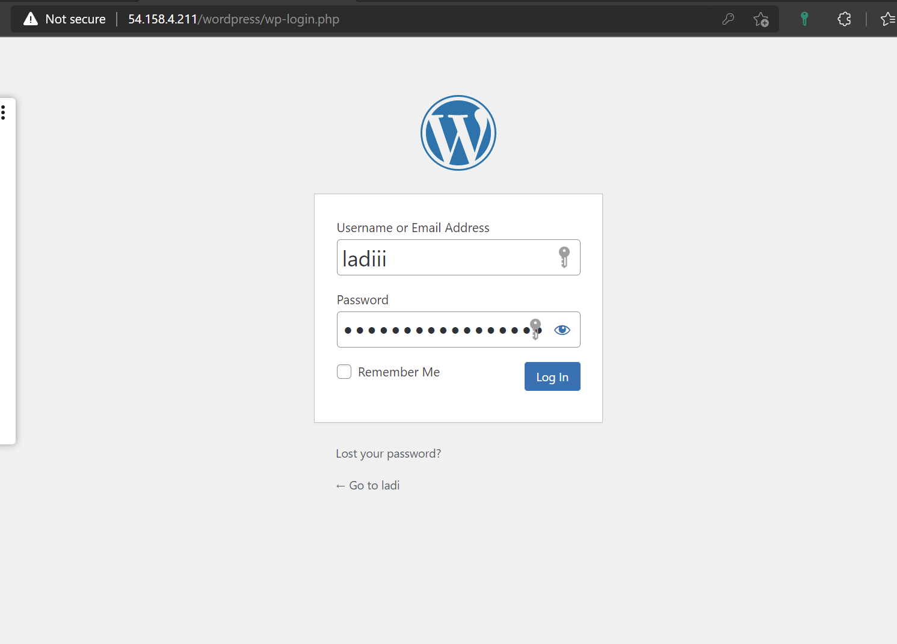

# WEB SOLUTION WITH WORDPRESS

## WEB SERVER CREATION

Launch an EC2 instance that will serve as a webserver for the wordpress with 3 volumes attached

Verify volumes are added to the webserver 

`lsblk` 

Create a single partiton on each of the 3 disks 

`sudo gdisk /dev/xvdf`

`sudo gdisk /dev/xvdg`

`sudo gdisk /dev/xvdh`

Use lsblk to verify the partitions 

Install lvm2 packages

`sudo yum install lvm2`

Check for available partions 
`sudo lvmdiskscan` 

Mark the 3 partioned disks as physical volumes

`sudo pvcreate /dev/xvdf1`

`sudo pvcreate /dev/xvdg1`

`sudo pvcreate /dev/xvdh1`

Verify that physical volumes are created

`sudo pvs`

Add the physical volumes to a volume group

`sudo vgcreate webdata-vg /dev/xvdh1 /dev/xvdg1 /dev/xvdf1`

Verify that volume group has been created 

`sudo vgs`

Create 2 logical volumes, one to store data for the website and another to store data for logs

`sudo lvcreate -n apps-lv -L 14G webdata-vg`

`sudo lvcreate -n logs-lv -L 14G webdata-vg`

Verify the logical volumes were created

`sudo lvs`

Verify the entire setup

`sudo vgdisplay -v`

Format the logical volumes with ext4 filesystem

`sudo mkfs -t ext4 /dev/webdata-vg/apps-lv`

`sudo mkfs -t ext4 /dev/webdata-vg/logs-lv`

Create /var/www/html directory to store website data

`sudo mkdir -p /var/www/html`

Create /home/recovery/logs directory to store backup log data

`sudo mkdir -p /home/recovery/logs`

Mount /var/www/html on apps-lv logical volume 

`sudo mount /dev/webdata-vg/apps-lv /var/www/html/`
 

Backup all files in log directory /var/log into /home/recovery/logs because all existing data in /var/log would be deleted when mounted

`sudo rysnc -av /var/log/. /home/ecovery/logs/

 

Mount /var/log on logs-lv logical volume 

`sudo mount /dev/webdata-vg/logs-lv /var/log`

Restore log files 

`sudo rsync -av /home/recovery/logs/. /var/log`

Get UUID of devices that will be updated in /etc/fstab file

`sudo blkid`

Update /etc/fstab file

`sudo vi /etc/fstab/`

Test the configuration and reload daemon 

Verify setup with df -h

`sudo mount -a`

`sudo systemctl daemon-reload`

Update redhat

`sudo yum -y update`

Install php and verify

`php -v`

Start and enable php 

`sudo systemctl start php-fpm`

`sudo systemctl enable php-fpm`

Check status of apache 

`sudo systemctl status httpd`

Create directory wordpress

`sudo mkdir wordpress`

In wordpress directory download wordpress

`sudo wget http://wordpress.org/latest.tar.gz`

Extract the tar file

`sudo tar xzvf latest.tar.gz`

Copy wordpress to /var/www/html

`sudo cp wordpress/wp-config-sample.php wordpress/wp-config.php`

`sudo cp -R wordpress /var/www/html/`

Configure SElinux Polices 

`sudo chown -R apache:apache /var/www/html/wordpress`

`sudo chcon -t httpd_sys_rw_content_t /var/www/html/wordpress -R`

`sudo setsebool -P httpd_can_network_connect=1`

## DATABASE SERVER CREATION

Followed same process as the creation of webserver 

On database server created a volume group named vg-database

`sudo vgcreate vg-database /dev/xvdf1 /dev/xvdg1 /dev/xvdh1`

verify volume group was sucessful

Create and verify logical volume 

`sudo lvcreate -n db-lv -L 24G vg-databas`

Format the logical volumes with ext4 filesystem

` sudo mkfs.ext4 /dev/vg-database/db-lv`

Create a directory /db

`sudo mkdir /db`

Mount db-lv to /db

`sudo mount /dev/vg-database/db-lv /db`

Check for UUID for the device

`sudo blkid`

Update /etc/fstab/

`sudo vi /etc/fstab`

Test the configuration and reload daemon 

`sudo mount -a`

`sudo systemctl daemon-reload`

Check setup 

`df -h`

Update redhat 

`sudo yum update`

Install mysql server

Configure database

`sudo mysql`

Verify database

`mysql> SHOW DATABASES;`

## connecting database to webserver

update redhat webserver

`sudo yum update`

Install mysql on webserver

`sudo yum install mysql`

Test the connection between webserver and database server

`sudo mysql -u ladi -h 172.31.42.175 -p`

`mysql> SHOW DATABASES;`

Update wp-config file in webserver with database details

`sudo vi wp_config.php`

Open port 80 on ec2 security groups 

Configure wordpress 

